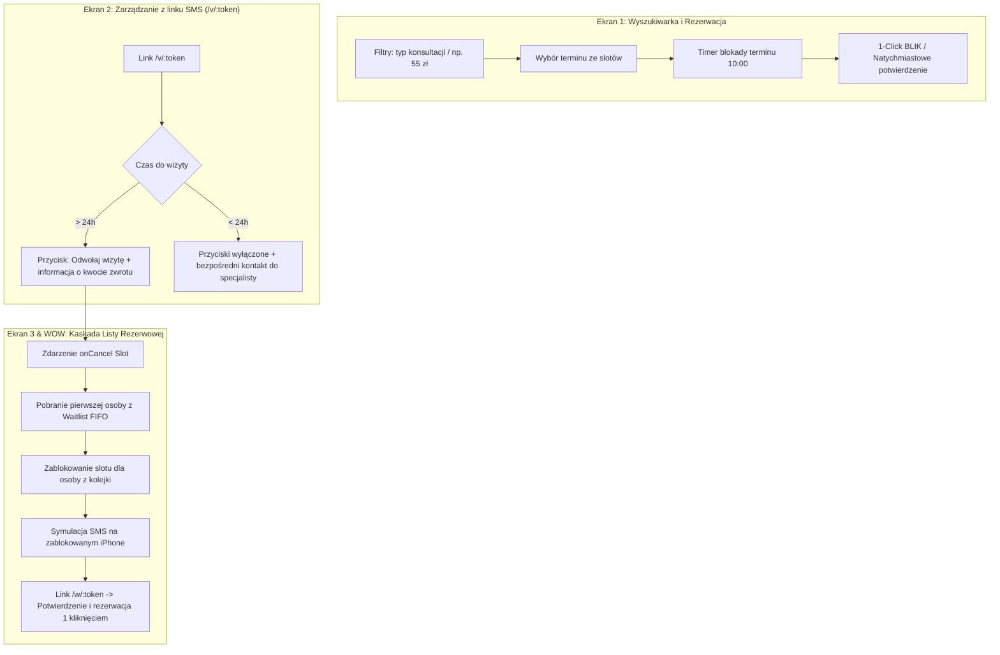

# 2. Proponowany Plan Działania

Plan wdrożenia opiera się na stworzeniu spójnej ścieżki prezentacyjnej, która w 100% odzwierciedla kluczowe reguły biznesowe Fundacji Niepodzielni i demonstruje działający system za makietą w trakcie 60-sekundowego pitchu.

## Przepływ Procesu (Flowchart)

## Etapy Realizacji i Kamienie Milowe

### 1. Inicjalizacja & Setup (09:00 – 09:30)
- Inicjalizacja projektu (Vite + React + TypeScript + Tailwind CSS).
- Konfiguracja stanu aplikacji (Zustand z persystencją w `localStorage`).
- Przygotowanie realistycznych polskich danych testowych (specjaliści, typy konsultacji, początkowe sloty).

### 2. BUILD I: Główna Ścieżka Pacjenta (09:30 – 12:30)
- **Ekran 1**: Wyszukiwarka terminów z filtrowaniem (niskopłatna 55 zł, diagnoza ADHD, asystent zdrowienia).
- Mechanizm blokady 10-minutowej z odliczaniem na żywo (`10:00` $\rightarrow$ `00:00`).
- Mock płatności BLIK (sukces w 1 kliknięcie bez zewnętrznych bramek).
- **Ekran 2**: Widok zarządzania wizytą (`/v/:token`) z obsługą reguły 24h:
  - Stan A: Wizyta za 3 dni ($>24\text{ h}$) – aktywne odwołanie ze zwrotem.
  - Stan B: Wizyta za 6 godzin ($<24\text{ h}$) – brak przycisku odwołania, prezentacja kontaktu do specjalisty.

### 3. BUILD II: Kaskada Listy Rezerwowej & Moment WOW (13:15 – 15:15)
- **Ekran 3**: Interaktywny komponent ramki telefonu (zablokowany ekran iPhone).
- Mechanizm kaskady: odwołanie wizyty przez pacjenta natychmiast generuje ofertę dla osoby z kolejki FIFO.
- Dyskretny komunikat SMS (brak wrażliwych słów o zdrowiu psychicznym na zablokowanym ekranie).
- Ścieżka akceptacji oferty przez link `/w/:token`.

### 4. Code Freeze & Pitch Sprint (15:15 – 17:00)
- Zamrożenie kodu o 15:15 – dopracowanie animacji przejść i danych demonstracyjnych.
- Przygotowanie skryptu pitchu (60 sekund, 1 historia).
- Nagranie awaryjne w OBS Studio (plan B na wypadek problemów z siecią).

## Powiązane Dokumenty
- [3. Architektura Techniczna i Model Danych](./03-architektura-i-dane.md)
- [4. Szczegółowy Zakres 3 Ekranów Demo](./04-ekrany-demo.md)
