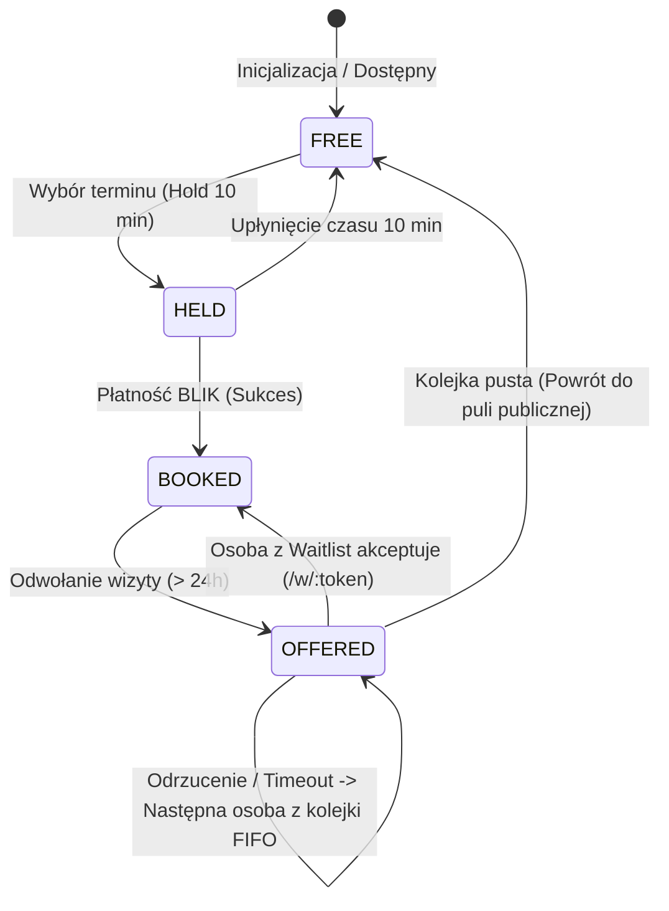

# 3. Architektura Techniczna i Model Danych

Architektura opiera się na reaktywnym, zsynchronizowanym modelu stanu oraz maszynie stanów terminu (*Slot State Machine*). Zamiast ciężkich zależności bazodanowych, cały model działa lokalnie w pamięci z możliwością persystencji i natychmiastowego resetu do stanu demo.

## Maszyna Stanów Slotu



## Model Danych (TypeScript)

```typescript
export type SlotStatus = 'free' | 'held' | 'booked' | 'offered';
export type ConsultationType = 'low_cost' | 'standard' | 'adhd' | 'recovery_assistant' | 'free';

export interface Specialist {
  id: string;
  name: string;
  role: string; // np. "Psychoterapeutka", "Asystentka zdrowienia"
  bio: string;
  avatarUrl?: string;
  weeklyLowCostCount: number;
}

export interface Slot {
  id: string;
  specialistId: string;
  specialistName: string;
  specialistRole: string;
  date: string; // format ISO
  time: string; // np. "14:00"
  type: ConsultationType;
  price: number; // np. 55, 140, 750, 37, 0 PLN
  status: SlotStatus;
  heldUntil?: number; // timestamp wygaśnięcia blokady
  holdReason?: 'booking' | 'waitlist_offer';
  bookedBy?: {
    patientName: string;
    patientPhone: string;
    bookingToken: string; // token do zarządzania /v/:token
    bookedAt: string;
  };
  offer?: {
    token: string; // token do akceptacji /w/:token
    waitlistEntryId: string;
    offeredToPhone: string;
    offeredToName: string;
    expiresAt: number;
  };
}

export interface WaitlistEntry {
  id: string;
  patientName: string;
  phone: string;
  specialistId?: string; // opcjonalnie konkretny specjalista lub dowolny
  type: ConsultationType;
  createdAt: number; // sortowanie FIFO
  status: 'waiting' | 'offered' | 'accepted' | 'expired';
}

export interface CoordinatorLogEntry {
  id: string;
  timestamp: string;
  action: 'HOLD_CREATED' | 'BOOKING_CONFIRMED' | 'VISIT_CANCELLED' | 'WAITLIST_OFFER_SENT' | 'WAITLIST_ACCEPTED';
  details: string;
  slotId: string;
}
```

## Kluczowe Mechanizmy Biznesowe

### 1. Zunifikowany Mechanizm Blokady (`Hold`)
Zarówno rezerwacja w toku przez pacjenta, jak i oferta ze zwolnionego terminu dla osoby z listy rezerwowej, korzystają z tego samego mechanizmu `heldUntil`. Slot w stanie blokady jest natychmiast wyłączany z publicznej wyszukiwarki.

### 2. Kolejka FIFO Listy Rezerwowej
Lista rezerwowa nie stosuje skomplikowanego scoringu – proste i sprawiedliwe FIFO (`createdAt`). Po odwołaniu wizyty funkcja `onCancelSlot(slotId)` pobiera pierwszy pasujący wpis:
```typescript
function onCancelSlot(slotId: string) {
  const slot = getSlot(slotId);
  const nextInLine = getNextWaitlistEntry(slot.specialistId, slot.type);
  
  if (nextInLine) {
    // Przejście do stanu OFFERED i wygenerowanie tokenu SMS
    offerSlotToWaitlist(slot.id, nextInLine);
  } else {
    // Brak chętnych w kolejce -> powrót do puli publicznej
    setSlotStatus(slot.id, 'free');
  }
  
  // Zapis do niezmiennego dziennika koordynatora
  logCoordinatorAction('VISIT_CANCELLED', `Wizyta ${slot.id} odwołana. Utworzono ofertę dla ${nextInLine?.patientName || 'publicznej puli'}.`);
}
```

### 3. Dziennik Koordynatora (*Append-Only*)
Każda zmiana stanu w systemie zapisuje wpis w rejestrze audytowym. Rejestr nie posiada operacji edycji ani usuwania wpisów, co gwarantuje pełną transparentność działań fundacji.

## Powiązane Dokumenty
- [2. Proponowany Plan Działania](./02-plan-dzialania.md)
- [4. Szczegółowy Zakres 3 Ekranów Demo](./04-ekrany-demo.md)
