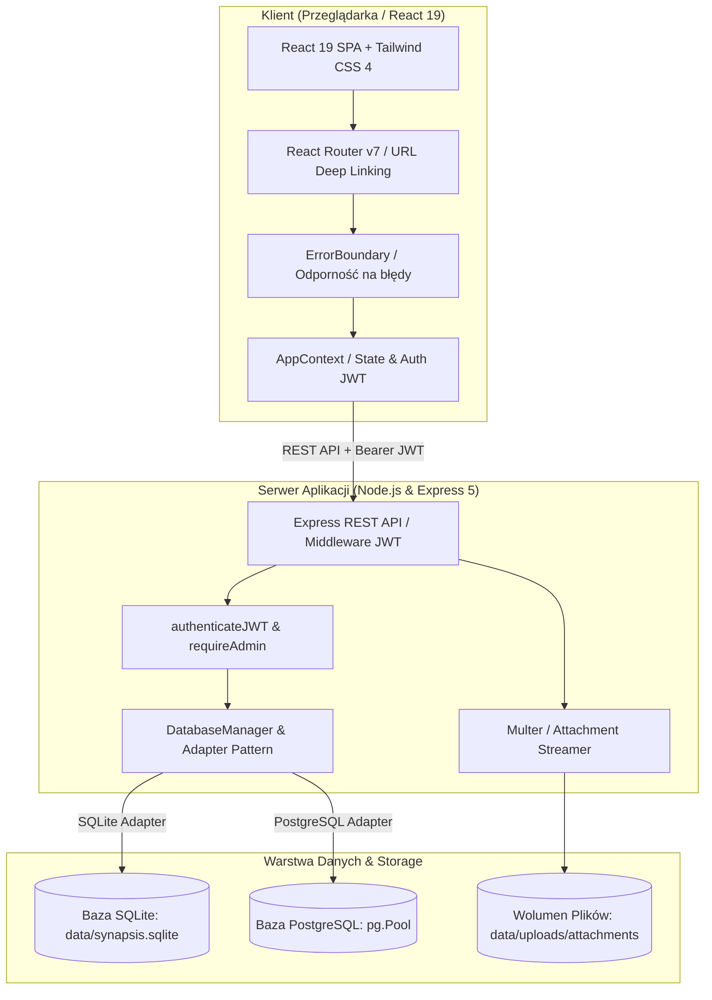

# Architektura systemu - Baza Porad Synapsis

Niniejszy dokument opisuje architekturę techniczną, przepływ danych, podział warstw oraz standardy bezpieczeństwa zaimplementowane w systemie **Baza Porad**.

---

## 🏗️ 1. Diagram architektury

---

## 💻 2. Frontend (warstwa prezentacji)

* **Framework i biblioteki**: React 19, TypeScript, React Router v7, Tailwind CSS 4, Lucide React.
* **Zarządzanie stanem i wydajność**:
  * Globalny stan zarządzany przez dedykowany `AppProvider` zoptymalizowany pod kątem renderowania za pomocą `useMemo` na poziomie wartości kontekstu.
  * Zastosowanie `useDeferredValue` do natychmiastowej responsywności wyszukiwarki kontaktów przy dużych zbiorach danych.
* **Granica błędów (`ErrorBoundary`)**:
  * Zabezpieczenie tras i modułów aplikacji przed awariami renderowania. W przypadku nieoczekiwanego błędu użytkownik otrzymuje czytelny interfejs naprawczy z opcją ponownej próby lub powrotu do strony głównej.
* **Code-Splitting i Lazy Loading**:
  * Wszystkie główne podstrony (`/records`, `/stats`, `/admin/*`, `/callers/:id`) oraz ciężkie moduły (`xlsx`) są ładowane asynchronicznie (`React.lazy` + `<Suspense>`), co gwarantuje start aplikacji w ułamku sekundy (Initial bundle < 425 kB).

---

## ⚙️ 3. Backend (warstwa logiki biznesowej)

* **Środowisko**: Node.js 22 LTS, Express 5, TypeScript (`tsx`).
* **Wzorzec adaptera bazy danych (`DatabaseAdapter`)**:
  * Abstrakcyjna warstwa izolująca logikę biznesową od konkretnego silnika relacyjnego.
  * **`SqliteAdapter`**: Szybka baza plikowa oparta na `better-sqlite3` z trybem WAL (*Write-Ahead Logging*).
  * **`PostgresAdapter`**: Produkcyjny silnik oparty na puli połączeń `pg.Pool` z obsługą typów `jsonb` i transakcji.
  * **Dynamiczne przełączanie w locie**: Administrator może zmieniać silnik bazy danych bezpośrednio z poziomu panelu `/admin`.
* **Walidacja i schemat**:
  * Drizzle ORM + Zod schemas: ścisła walidacja każdego przychodzącego payloadu i schematu relacyjnego.

---

## 📁 4. Magazyn załączników (architektura dyskowa)

* **Zasada działania**:
  * Pliki załączników (orzeczenia PDF, wypisy medyczne, zdjęcia, zestawienia Excel) **nie są przechowywane w bazie danych**, co zapobiega puchnięciu bazy i degradacji wydajności.
  * Pliki trafiają bezpośrednio na dysk / montowany wolumen kontenera (`data/uploads/attachments/` lub ścieżka ze zmiennej `ATTACHMENTS_DIR`).
* **Punkty końcowe API**:
  * `POST /api/attachments/upload`: Odbiór pliku przez strumień `multer`, zapis ze zrandomizowanym identyfikatorem kolizyjnym, zwrot metadanych i adresu URL.
  * `GET /api/attachments/:id`: Bezpieczne serwowanie pliku ze sprawdzeniem tokenu JWT i poprawnymi nagłówkami MIME/Content-Disposition.
  * `DELETE /api/attachments/:id`: Fizyczne usunięcie pliku z dysku przy usunięciu załącznika w kartotece.

---

## 🔒 5. Bezpieczeństwo i ochrona danych (RODO)

1. **Uwierzytelnianie JWT**:
   * Tokeny podpisane algorytmem HMAC-SHA256 z 24-godzinnym czasem wygaśnięcia.
   * Przechowywanie w pamięci sesyjnej i automatyczne dołączanie w nagłówku `Authorization: Bearer <token>`.
2. **Kontrola uprawnień (RBAC)**:
   * Podział na role: `Konsultant` (dostęp do wyszukiwarki, kartotek, rejestracji porad) oraz `Administrator` (pełen dostęp do `/admin`, konfiguracji bazy, zarządzania kontami i eksportu danych).
   * Blokady programowe (*Guardrails*): brak możliwości odebrania uprawnień samemu sobie oraz głównemu kontu systemowemu `spec-admin`.
3. **Anonimizacja eksportu i ochrona przed CSV Injection**:
   * Domyślny tryb eksportu zastępuje dane osobowe identyfikatorami anonimowymi (`DZWON-XXXXXX`) i czyści treść notatek z numerów PESEL, telefonów i e-maili.
   * Wszystkie komórki zaczynające się od znaków formuł (`=`, `+`, `-`, `@`) są prefiksowane apostrofem, uniemożliwiając wykonanie złośliwych makr w arkuszach Excel.
