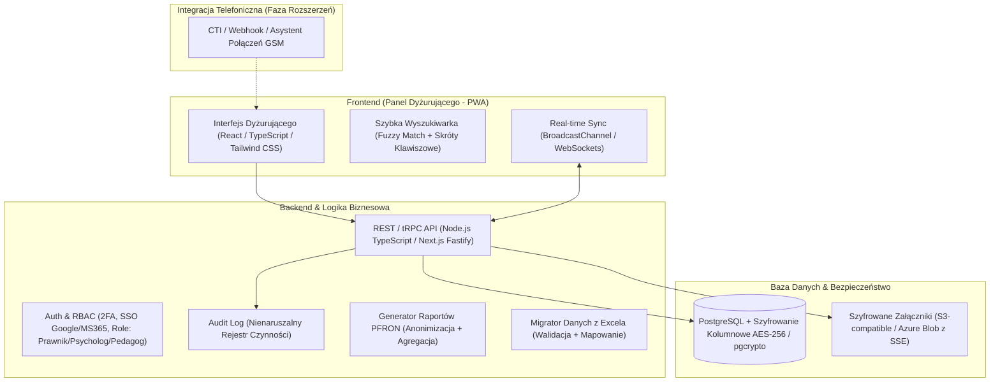
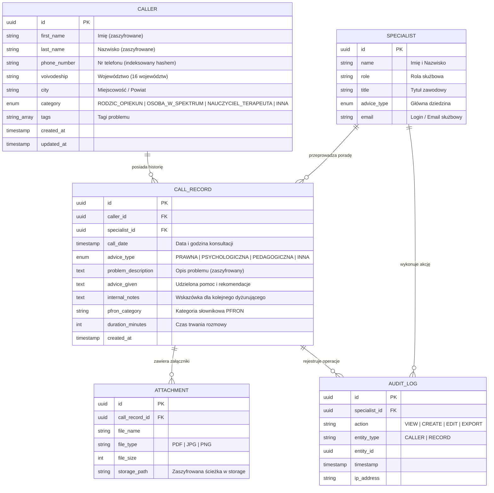

# Plan i Propozycja Wdrożenia: Wspólna Baza Historii Rozmów dla Dyżurujących Specjalistów (Linia Poradnicza PFRON)

## 1. Kontekst Biznesowy i Diagnoza Problemu

* **Organizacja:** Fundacja wspierająca od ponad 35 lat osoby w spektrum autyzmu i ich rodziny (podmiot leczniczy, ok. 120 pracowników).
* **Usługa:** Bezpłatna, ogólnopolska linia poradnicza finansowana ze środków PFRON (~4000 porad rocznie, ok. 330 porad/miesiąc).
* **Użytkownicy:** Specjalistki na dyżurach telefonicznych (prawniczki, pedagożki, psycholożki) o różnym poziomie biegłości cyfrowej.
* **Główny problem operacyjny:** 
  * Obecny proces opiera się na wspólnym pliku Excel, który utrudnia równoległą pracę wielu osób (blokowanie arkusza, ryzyko nadpisywania wpisów).
  * W trakcie dzwonienia telefonu specjalistka musi w kilkanaście sekund ustalić: czy dzwoniący kontaktował się wcześniej, kto mu doradzał (prawnik, psycholog, pedagog), jakie były zalecenia i czy należy kontynuować kontakt z tym samym specjalistą.
  * Zjawisko „sprawdzania” (*forum shopping*) – dzwoniący ponawiają kontakt z nadzieją, że inny specjalista wyda odmienną opinię.
* **Główny cel wdrożenia:** Skrócenie czasu identyfikacji historii dzwoniącego do **poniżej 5 sekund**, pełna bezkonfliktowa praca współbieżna, ujednolicenie poradnictwa oraz automatyzacja sprawozdawczości dla PFRON.
* **Rygor bezpieczeństwa i RODO:** Dane dotyczące zdrowia i niepełnosprawności (art. 9 RODO, podmiot leczniczy) – bezwzględny wymóg pełnego szyfrowania, kontroli dostępu, nienaruszalnego rejestru audytu i prewencji przed błędnym scalaniem osób o podobnych danych.

---

## 2. Architektura Systemu i Rekomendowany Stack Technologiczny

System zaprojektowano jako lekką, responsywną aplikację webową (PWA), zoptymalizowaną pod szybkość działania, obsługę klawiaturą oraz intuicyjny interfejs.



### Wybrane Technologie:
* **Frontend:** TypeScript, React, Tailwind CSS, Lucide Icons, SheetJS (`xlsx`), Canvas-Confetti.
* **Warstwa Danych & State:** PostgreSQL / IndexedDB / LocalStorage Cache + `BroadcastChannel` (wielodostęp w czasie rzeczywistym).
* **Bezpieczeństwo:** Szyfrowanie danych w spoczynku (*at rest*) i w tranzycie (*in transit* TLS 1.3), mechanizmy RBAC i Audit Logging.

---

## 3. Model Danych (Data Schema)



---

## 4. Przepływ Pracy Specjalistki na Dyżurze (User Journey)

1. **Identyfikacja w trakcie połączenia (0–5 sekund):**
   * Specjalistka wpisuje nazwisko lub numer telefonu dzwoniącego (skrót `/` lub `Ctrl + K`).
   * **Mechanizm anty-pomyłkowy (Disambiguation):** Jeśli w bazie istnieje kilka osób o tym samym nazwisku (np. *Katarzyna Kowalska z Warszawy* i *Katarzyna Kowalska z Katowic*), system wyświetla karty porównawcze z prośbą o weryfikację miejscowości/telefonu.
2. **Natychmiastowy kontekst (5–10 sekund):**
   * **Smart AI Briefing:** 2-zdaniowe podsumowanie dotychczasowej historii na szczycie kartoteki.
   * **Oś czasu porad:** Wyświetlenie chronologicznych wpisów wraz z żółtymi alertami wskazówek od poprzedników.
3. **Rejestracja porady podczas lub po rozmowie (Alt + N):**
   * Formularz z automatycznym przypisaniem daty i zalogowanej specjalistki.
   * Wybór typu: Prawna / Psychologiczna / Pedagogiczna, wpisanie problemu, zaleceń i notatki dla kolejnej dyżurującej.
4. **Współbieżność Live:**
   * Inne dyżurujące osoby widzą w czasie rzeczywistym wskaźnik obecności i natychmiastową aktualizację bazy bez odświeżania strony.

---

## 5. Harmonogram Realizacji i Roadmapa

| Etap | Zakres | Rezultat |
| :--- | :--- | :--- |
| **Dzień 1 (Rdzeń MVP / Hackathon Demo)** | • Błyskawiczna wyszukiwarka kartotek i historia porad<br>• Formularz rejestracji z synchronizacją współbieżną<br>• Filtrowanie i eksport do CSV (UTF-8 BOM)<br>• Migrator dotychczasowego pliku Excel | **Działająca aplikacja gotowa do testów i demonstracji** |
| **Faza 1 (Bezpieczeństwo & Pilotaż, Tyg. 1–2)** | • Wdrożenie autentykacji 2FA / SSO<br>• Szyfrowanie bazy danych (pgcrypto / AES-256)<br>• Moduł Audit Log zgodny z RODO i podmiotem leczniczym<br>• Testy użyteczności ze specjalistkami fundacji | Środowisko testowe / stagingowe fundacji |
| **Faza 2 (Raporty PFRON & Załączniki, Tyg. 3–4)** | • Generator zanonimizowanych zestawień PFRON<br>• Bezpieczne repozytorium dokumentów (orzeczenia, pisma w PDF/JPG)<br>• Rozszerzenie asystenta AI o kategoryzację zgłoszeń | Kompletny system sprawozdawczo-dokumentacyjny |
| **Faza 3 (Produkcja & Telefonia, Miesiąc 2)** | • Wdrożenie produkcyjne w chmurze / na serwerze fundacji<br>• Integracja z telefonią (asystent połączeń GSM / stacjonarny CTI)<br>• Szkolenia zespołu (120 pracowników) i stabilizacja | Pełne zastąpienie arkusza Excel na linii wsparcia |

---

## 6. Bezpieczeństwo Danych i Zgodność z Prawem (Podmiot Leczniczy)

1. **Art. 9 RODO (Dane szczególnych kategorii):** Informacje o zdrowiu i niepełnosprawności dzieci są chronione rygorystycznymi uprawnieniami.
2. **Pełne szyfrowanie:** Dane identyfikacyjne oraz opisy problemów są szyfrowane kluczem aplikacji.
3. **Automatyczna Anonimizacja Raportowa:** Eksporty dla grantodawcy (PFRON) generowane są bez imion, nazwisk i numerów telefonów (identyfikatory `DZWON-XXXXXX`).
4. **Niezaprzeczalny Rejestr Audytu:** Każde wyświetlenie lub edycja kartoteki zapisuje rekord z ID specjalistki i znacznikiem czasu.

---

## 7. Instrukcja Uruchomienia i Testów

Aplikacja zrealizowana w ramach Dnia 1 jest w pełni gotowa do uruchomienia lokalnego:

```powershell
npm run dev
```

Adres w przeglądarce: `http://localhost:5173`
